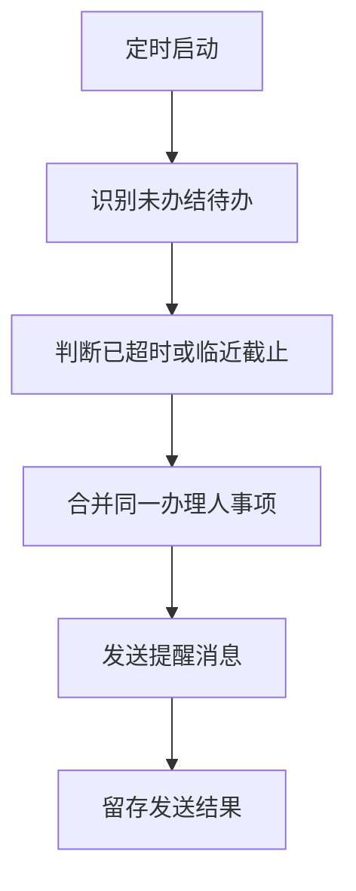
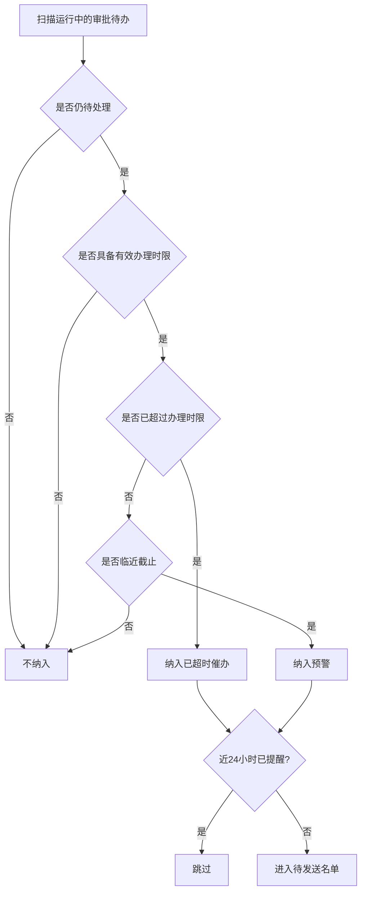

# 消息催办流程图

```mermaid
flowchart TB
    A[定时启动] --> B[识别未办结待办]
    B --> C[判断已超时或临近截止]
    C --> D[合并同一办理人事项]
    D --> E[发送提醒消息]
    E --> F[留存发送结果]
```

```mermaid
flowchart TD
    S[扫描运行中的审批待办] --> A{是否仍待处理}
    A -->|否| X[不纳入]
    A -->|是| B{是否具备有效办理时限}
    B -->|否| X
    B -->|是| C{是否已超过办理时限}
    C -->|是| O[纳入已超时催办]
    C -->|否| D{是否临近截止}
    D -->|是| V[纳入预警]
    D -->|否| X
    O --> E{近24小时已提醒?}
    V --> E
    E -->|是| Skip[跳过]
    E -->|否| Out[进入待发送名单]
```

