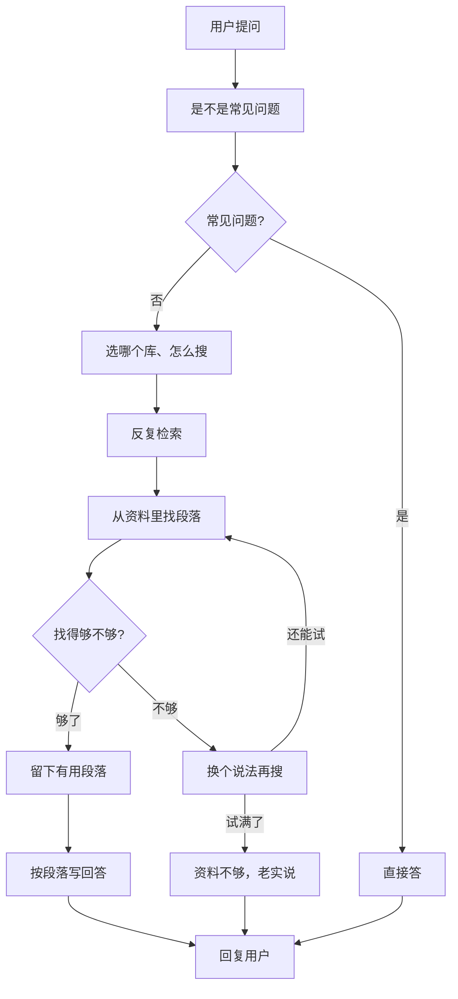
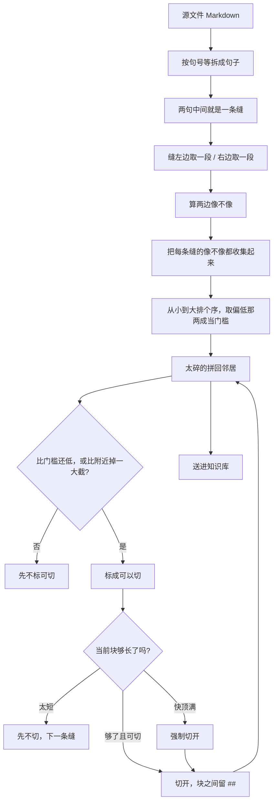

# 知识库问答流程图

```mermaid
flowchart TD
    A[用户提问] --> B[是不是常见问题]
    B --> C{常见问题?}
    C -->|是| Z[直接答]
    C -->|否| D[选哪个库、怎么搜]
    D --> E[反复检索]
    E --> F[从资料里找段落]
    F --> G{找得够不够?}
    G -->|够了| H[留下有用段落]
    G -->|不够| I[换个说法再搜]
    I -->|还能试| F
    I -->|试满了| J[资料不够，老实说]
    H --> K[按段落写回答]
    K --> Z2[回复用户]
    J --> Z2
    Z --> Z2
```

## 滑动窗口切段

```mermaid
flowchart TD
    S[源文件 Markdown] --> A[按句号等拆成句子]
    A --> B[两句中间就是一条缝]
    B --> C[缝左边取一段 / 右边取一段]
    C --> D[算两边像不像]
    D --> E[把每条缝的像不像都收集起来]
    E --> P[从小到大排个序，取偏低那两成当门槛]
    P --> M[再看附近几条缝，算出中间水平]
    M --> F{比门槛还低，或比附近掉一大截?}
    F -->|否| G[先不标可切]
    F -->|是| H[标成可以切]
    H --> I{当前块够长了吗?}
    I -->|太短| J[先不切，下一条缝]
    I -->|快顶满| K[强制切开]
    I -->|够了且可切| L[切开，块之间留 ##]
    K --> L
    L --> M[太碎的拼回邻居]
    M --> N[送进知识库]
```

## 图

源文件：`assets/diagrams/rag-workflow.drawio`、`assets/diagrams/rag-chunk-workflow.drawio`
