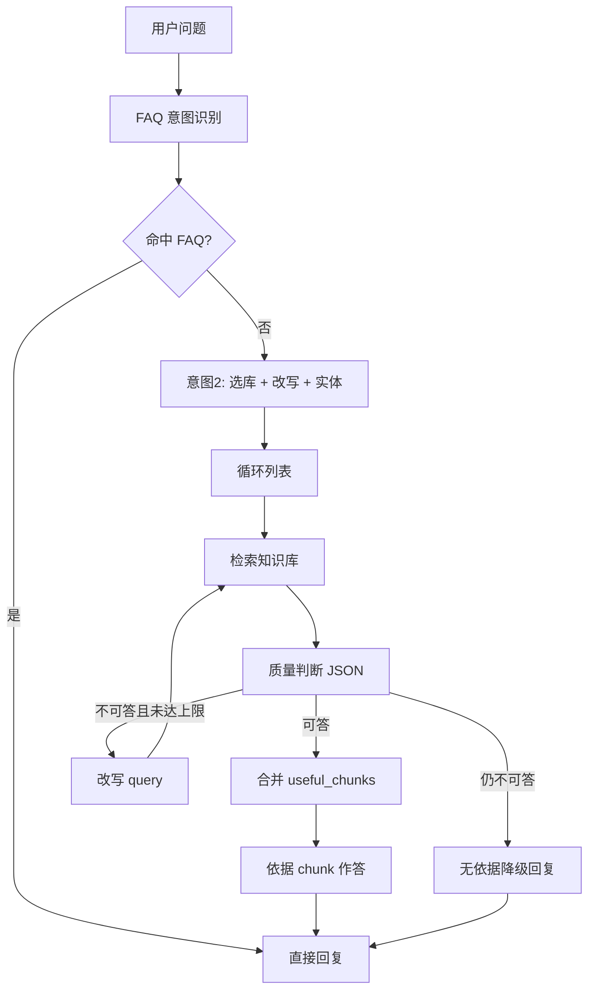
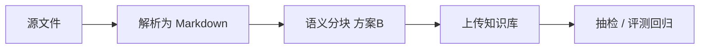

# RAG Agent 流程图

```mermaid
flowchart TD
    A[用户问题] --> B[FAQ 意图识别]
    B --> C{命中 FAQ?}
    C -->|是| Z[直接回复]
    C -->|否| D[意图2: 选库 + 改写 + 实体]
    D --> E[循环列表]
    E --> F[检索知识库]
    F --> G[质量判断 JSON]
    G -->|可答| H[合并 useful_chunks]
    G -->|不可答且未达上限| I[改写 query]
    I --> F
    G -->|仍不可答| J[无依据降级回复]
    H --> K[依据 chunk 作答]
    K --> Z
    J --> Z
```

## 入库侧（RPA / 脚本）

```mermaid
flowchart LR
    S[源文件] --> P[解析为 Markdown]
    P --> C[语义分块 方案B]
    C --> U[上传知识库]
    U --> V[抽检 / 评测回归]
```
