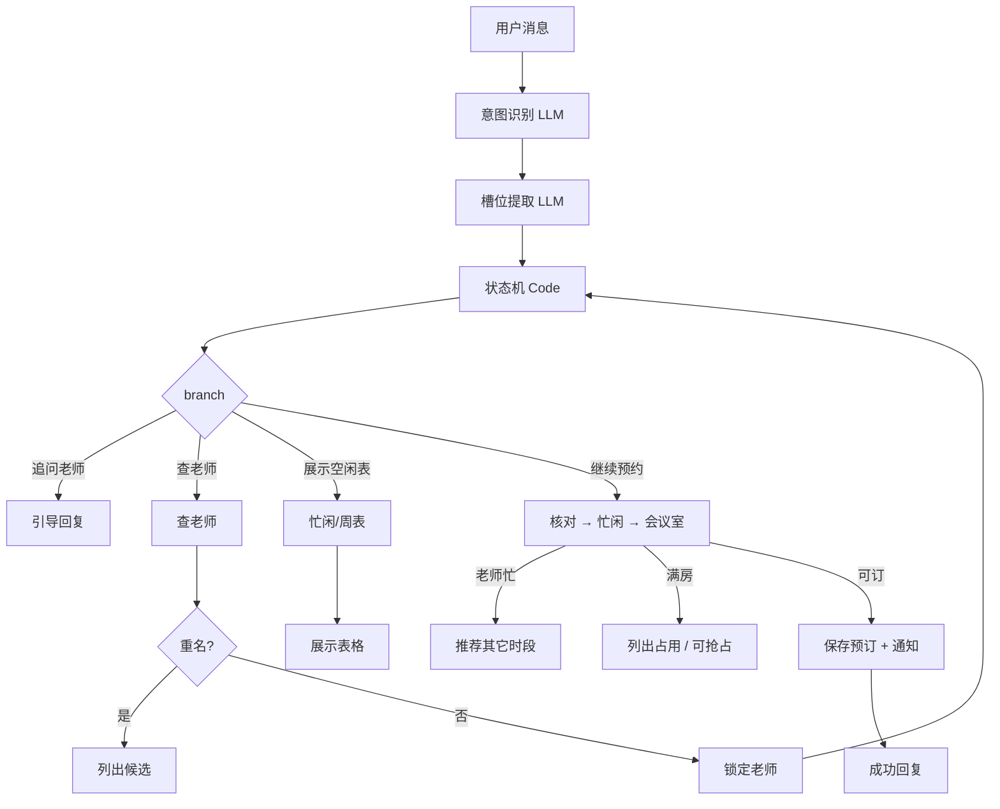

# 会议预约流程图

```mermaid
flowchart TD
    U[用户消息] --> I[意图识别 LLM]
    I --> S[槽位提取 LLM]
    S --> M[状态机 Code]
    M --> R{branch}
    R -->|追问老师| A1[引导回复]
    R -->|查老师| T[查老师]
    T --> D{重名?}
    D -->|是| A2[列出候选]
    D -->|否| L[锁定老师]
    R -->|展示空闲表| W[忙闲/周表]
    R -->|继续预约| C[核对 → 忙闲 → 会议室]
    C -->|老师忙| A3[推荐其它时段]
    C -->|满房| A4[列出占用 / 可抢占]
    C -->|可订| B[保存预订 + 通知]
    L --> M
    W --> A5[展示表格]
    B --> OK[成功回复]
```

## 画布（SVG）

- `assets/screenshots/meeting-canvas.svg`：全景  
- `assets/screenshots/meeting-branch.svg`：状态机 / 分支特写
