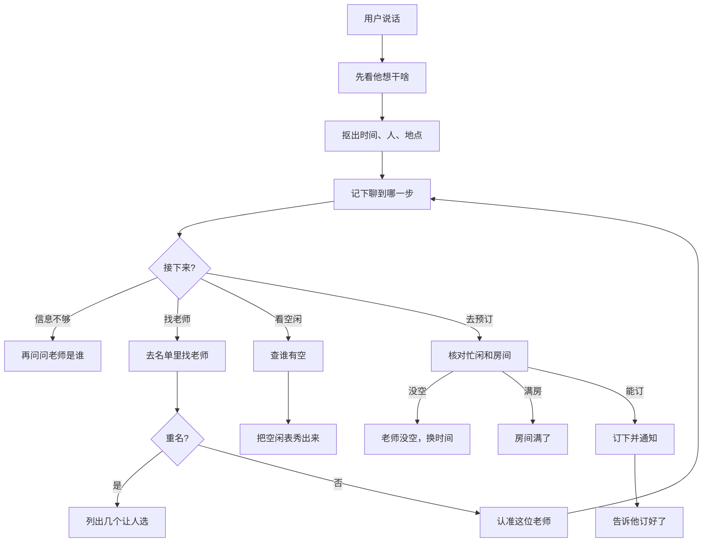

# 会议预约流程图

```mermaid
flowchart TD
    U[用户说话] --> I[先看他想干啥]
    I --> S[抠出时间、人、地点]
    S --> M[记下聊到哪一步]
    M --> R{接下来?}
    R -->|信息不够| A1[再问问老师是谁]
    R -->|找老师| T[去名单里找老师]
    T --> D{重名?}
    D -->|是| A2[列出几个让人选]
    D -->|否| L[认准这位老师]
    R -->|看空闲| W[查谁有空]
    R -->|去预订| C[核对忙闲和房间]
    C -->|没空| A3[老师没空，换时间]
    C -->|满房| A4[房间满了]
    C -->|能订| B[订下并通知]
    L --> M
    W --> A5[把空闲表秀出来]
    B --> OK[告诉他订好了]
```

## 图

源文件：`assets/diagrams/meeting-workflow.drawio`
