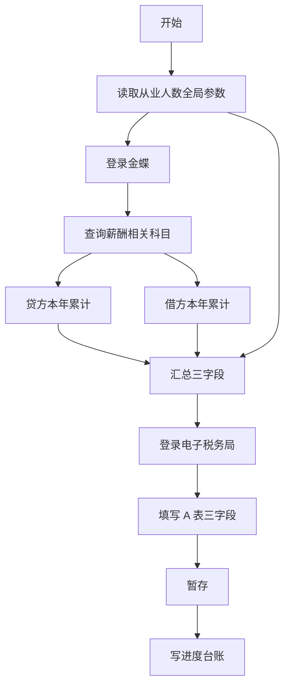

# 税务 RPA 流程图

```mermaid
flowchart TD
    A[开始] --> B[读取从业人数全局参数]
    B --> C[登录金蝶]
    C --> D[查询薪酬相关科目]
    D --> E[贷方本年累计]
    D --> F[借方本年累计]
    E --> H[汇总三字段]
    F --> H
    B --> H
    H --> I[登录电子税务局]
    I --> J[填写 A 表三字段]
    J --> K[暂存]
    K --> L[写进度台账]
```

```mermaid
flowchart LR
    S1[初始化] --> S2[登录金蝶]
    S2 --> S3[获取金额]
    S3 --> S4[税务填报]
    S4 --> S5[暂存收尾]
```
