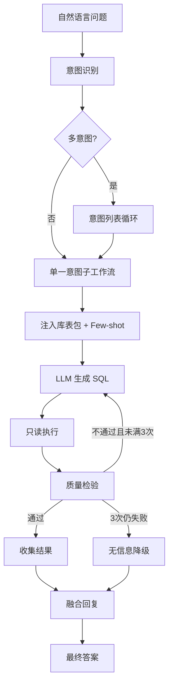

# 智能问数流程图

```mermaid
flowchart TD
    Q[自然语言问题] --> I[意图识别]
    I --> L{多意图?}
    L -->|是| C[意图列表循环]
    L -->|否| S[单一意图子工作流]
    C --> S
    S --> P[注入库表包 + Few-shot]
    P --> G[LLM 生成 SQL]
    G --> E[只读执行]
    E --> V[质量检验]
    V -->|不通过且未满3次| G
    V -->|通过| M[收集结果]
    V -->|3次仍失败| N[无信息降级]
    M --> F[融合回复]
    N --> F
    F --> A[最终答案]
```
