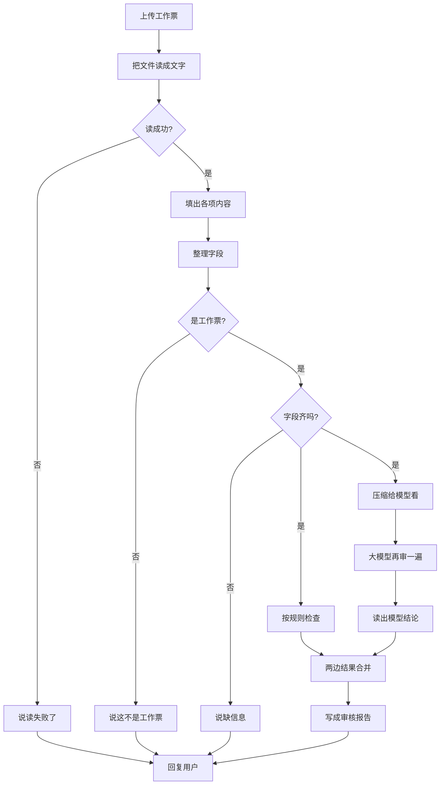

# 工作票审核流程图

```mermaid
flowchart TD
    A[上传工作票] --> B[把文件读成文字]
    B --> C{读成功?}
    C -->|否| F1[说读失败了]
    C -->|是| D[填出各项内容]
    D --> E[整理字段]
    E --> G{是工作票?}
    G -->|否| F2[说这不是工作票]
    G -->|是| H{字段齐吗?}
    H -->|否| F3[说缺信息]
    H -->|是| I[按规则检查]
    H -->|是| J[压缩给模型看]
    J --> K[大模型再审一遍]
    K --> L[读出模型结论]
    I --> M[两边结果合并]
    L --> M
    M --> N[写成审核报告]
    F1 --> O[回复用户]
    F2 --> O
    F3 --> O
    N --> O
```

## 图

源文件：`assets/diagrams/ticket-workflow.drawio`
