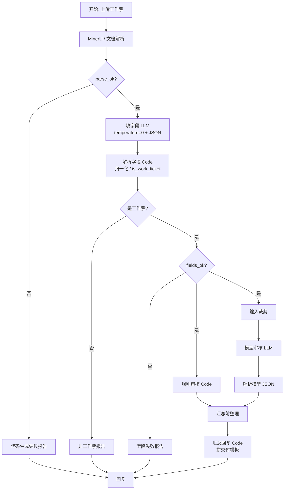

# 工作票审核 · 流程图

```mermaid
flowchart TD
    A[开始: 上传工作票] --> B[MinerU / 文档解析]
    B --> C{parse_ok?}
    C -->|否| F1[代码生成失败报告]
    C -->|是| D[填字段 LLM<br/>temperature=0 + JSON]
    D --> E[解析字段 Code<br/>归一化 / is_work_ticket]
    E --> G{是工作票?}
    G -->|否| F2[非工作票报告]
    G -->|是| H{fields_ok?}
    H -->|否| F3[字段失败报告]
    H -->|是| I[规则审核 Code]
    H -->|是| J[输入裁剪]
    J --> K[模型审核 LLM]
    K --> L[解析模型 JSON]
    I --> M[汇总前整理]
    L --> M
    M --> N[汇总回复 Code<br/>拼交付模板]
    F1 --> O[回复]
    F2 --> O
    F3 --> O
    N --> O
```

## 画布

`assets/screenshots/ticket-canvas.svg`
